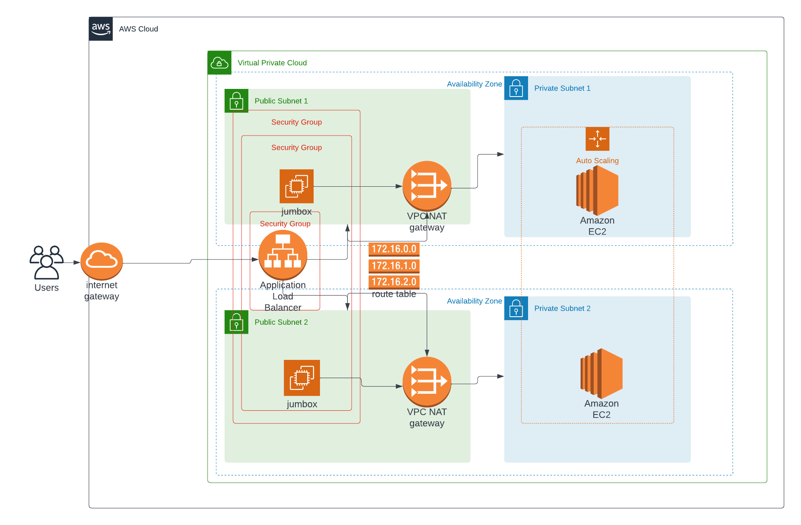

# High-Availability-Web-App
Deploy a High-Availability Web App using Cloud Formation

1- Create network stack with the following command
```bash
aws cloudformation create-stack --stack-name network --template-body file://network.yaml  --parameter file://network-prams.json --profile IaC
```

2- Create the compute resources stack with the following command
```bash
aws cloudformation create-stack --stack-name compute --template-body file://compute.yaml  --parameter file://compute-prams.json --capabilities "CAPABILITY_IAM" "CAPABILITY_NAMED_IAM" --profile IaC
```

3- Hit the public dnc for [Udagram app](http://compu-elast-nnvvs5iv6x3n-1424379892.us-east-1.elb.amazonaws.com/)

4- Hove a look on Cloud Architecture Digram 
